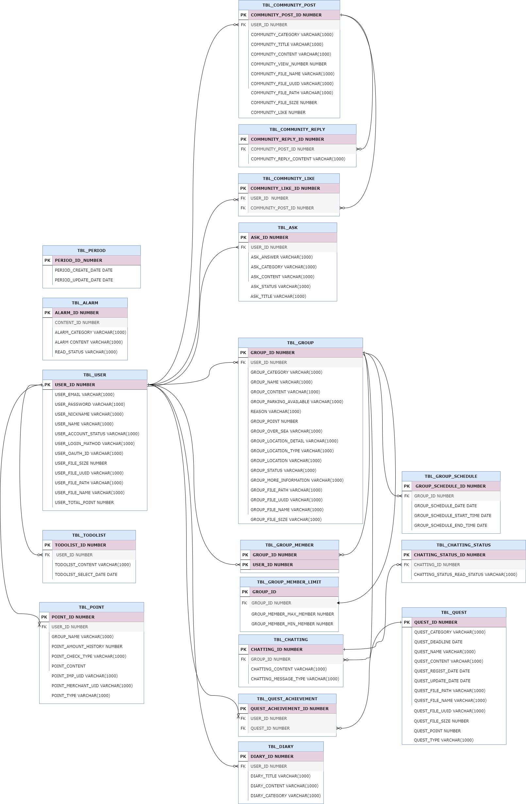

# MyOcean
- 청년 우울증을 해소하기 위한 심리 치료 서비스

# 프로젝트 목적 
- 취업난, 코로나 등 줄어든 사회적 입지로 스트레스에 시달리며 불안 및 우울 장애가 늘어나고 있는 20대들을 위해서 청년들의 우울감 해소를 위해
생활의 활력을 주는 서비스들과, 교환일기를 통해 말 못할 이야기들을 서로 털어놓아 마음을 놓을 수 있으며, 모임을 통해 교류의 장을 마련하여
서로 함께하고 생각을 공유하는 웹서비스를 만들기 위해 MyOcean 프로젝트를 기획했습니다.

# 구현 기술 스택 
- JDK 11.0.15
- Oracle (11g)
- Jpa
- SpringBoot 2.7.5
- Thymeleaf
- HTML, CSS, JS
- JQuery 3.6
- QueryDsl 5.0
- AJAX
- WebSocket
- Quartz
- OAuth 2.0 Naver/Kakao/Google
- SummerNote api
- Tiny.js
- iamport api
- EmailJS api

 
# 테스트 환경
- Junit 5.0
- Postman

# Dependency
- Gradle

# 프로젝트에서 맡은 역할 
- OAuth2를 이용한 네이버 로그인 회원가입
- TodoList-나의 버킷리스트를 날짜별로 작성 및 관리할 수 있는 서비스를 restful api로 구현
- 메인 페이지 및 각 서비스로 페이지 연결
- 커뮤니티 검색 서비스, 모임 페이지를 제외하고 고정 상단 영역의 검색바로 검색 시 검색 결과 페이지로 이동, 검색 결과 시 필터 서비스 제공
- 모임 검색 서비스, 모임 페이지에서 검색 시 모임 게시글 검색 결과를 restful api로 구현, 페이지네이션 처리

# ERD

# 느낀 점
- 프로젝트를 하면서 어려웠던 점
  - 기술적인 측면에서 데이터베이스에 날짜관련 항목을 웹페이지에서 주고받는 과정이 가장 어려웠다.
  투두리스트 서비스는 자신의 버킷리스트를 날짜별 피드형식으로 작성하는 서비스인데, 월별 투두리스트를 표현하는 과정에서 날짜별 정렬과 같은 날짜 내에 시간 순 정렬 등 
  JAVA와 JS를 이용해 Date 타입의 자료들을 가공하는 과정이 어려웠던 것 같다.
- 어려웠던 점을 극복한 방법
  - 우선 동기들, 강사님과 알고리즘을 확립한 뒤 구글링을 통해서 해당 로직을 구현하는 방법에 대해 찾아보았다.
  LocalDate, LocalTime, LocalDateTime의 자료형과 DateTimeFormatter Class를 이용하여 형변환을 한 뒤 자료를 주고받았고, DB에서 자료를 불러올 때 orderby를 이용해 날짜 순 정렬과 시간 순 정렬을 해서 가져왔다. 이렇게 가공된 데이터를 기반으로 JS를 이용해 정렬된 데이터를 나열하였다.
  추후 아쉬운 점은 Spring에서 지원하는 @DateTimeFormat이라는 어노테이션을 통해서 형변환 없이 웹과 DB간의 자료를 주고받을 수 있는 방법이 있다는 사실을 알았고, 나중에는 이를 이용해서 날짜 관련 데이터를 더 간편하게 관리할 수 있을 것 같다.
- 프로젝트를 하면서 느낀 점
  - 저번 JSP 프로젝트는 네이버 api연결에 집중하여 실제 DB 연동을 통한 웹개발에 집중할 수 없었던 점이 가장 아쉬웠었다.
  하지만 이번 프로젝트를 통해 실제 테이블을 조작하여 데이터를 가공할 수 있어서 좋았다.
  또한 SpringBoot를 이용하여 RestFul Api를 구현해보았는데, RestController를 이용하여 더 쉽고 빠르게 개발할 수 있다는 점이 가장 흥미로웠다.
  맡은 부분에 있어서 완성을 할 수 있었다는 점이 가장 뿌듯했으며, 앞으로도 SpringBoot, JPA, QueryDSL이라는 기술에 대해 더 깊은 공부를 하고 싶다.

